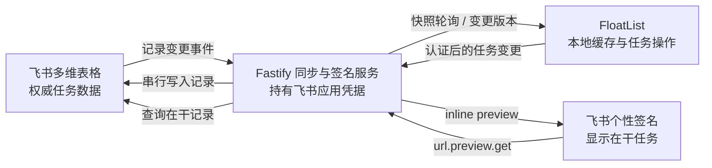

# FloatList × 飞书多维表格 × 个性签名三端同步规划书

> 本文是 2026-07 的 v0.2 历史实施记录，旧接口和路径仅用于追溯。当前 v0.3/schema v5/同步协议 v2 行为请以 [`ARCHITECTURE.md`](ARCHITECTURE.md) 和仓库根目录文档为准。

> 更新日期：2026-07-23
> 桌面端：FloatList（Tauri 2 / React / Zustand）
> 服务端：`qnianjinri-del/feishu-sign-preview`（Fastify / 飞书链接预览）
> 核心目标：多维表格、悬浮清单和飞书个性签名共享同一套任务与“正在做”状态

## 当前实施状态（2026-07-23）

- 阶段 1 已完成：schema v3、四态、一层子事项、受阻原因、父项进度、根事项唯一“正在做”和界面测试均已落地。
- 阶段 2 已完成：同步仓储、稳定 ID 回填、认证快照、ETag、幂等 mutation、串行写入、父子约束、缓存失效和健康检查均有自动化测试；用户测试表已补齐字段，真实读写及恢复测试通过。
- 签名读取按 `FloatList顺序` 稳定选择根事项中的“在干”记录。父行 `子状态` 显示当前子事项名称，完整子事项数据内嵌在父行隐藏字段中，不生成主表重复行，也不改变根“在干”或签名。
- 阶段 3 已完成：桌面端已接入 Rust 原生同步客户端、macOS 钥匙串、持久化 outbox、ETag 轮询、手动同步、首次合并选择、版本冲突处理和行级同步状态。
- 阶段 4 已完成：前端 50 项测试、服务端 38 项测试、Rust 测试、lint、前端 build、cargo check 和 `.app` 打包均通过。真实打包应用已保存独立 Client Token并启用同步；当前服务端快照包含 24 个根事项与 4 个内嵌子事项，飞书主表无重复子事项行，且只有一条根“在干”事项。

## 1. 目标定义

这次合并不只是把签名链接放进 FloatList，而是建立一套完整的任务同步系统：

1. 在飞书多维表格新增或修改任务后，FloatList 自动看到变化。
2. 在 FloatList 新增、编辑、排序、完成或删除任务后，多维表格同步更新。
3. 事项状态从当前的“完成 / 未完成”升级为：
   - `待办`
   - `在干`，FloatList UI 显示为“正在做”
   - `受阻`，同时记录具体卡点
   - `已完成`
4. FloatList 中“正在做”的任务使用绿色强调样式。
5. 用户可以在任务上右键选择“标记为正在做”。
6. 同一时间默认只能有一条根事项处于“正在做”；每个父事项可有一条子事项处于“正在做”。
7. 个性签名服务只读取根事项中状态为“在干”的任务并显示。
8. 子事项的推进状态只体现在 FloatList 子项和多维表格“子状态”中，不直接替换签名。
9. 父事项可包含一层子事项，并同步完成进度、当前推进步骤和受阻原因。

## 2. 总体架构结论

推荐把飞书多维表格设为**权威数据源**，而不是让桌面本地 Store 与表格相互猜测谁更新得更晚。

三端职责：

- **飞书多维表格**：任务的权威数据、多人协作入口和最终状态来源。
- **FloatList**：多维表格任务的本地缓存、快速操作界面和离线编辑端。
- **签名预览服务**：统一访问飞书 API，为 FloatList 提供同步网关，并为飞书签名生成当前任务预览。



关键原则：

- FloatList 不直接持有飞书 App Secret。
- FloatList 不直接调用飞书开放平台 API。
- 所有飞书读写都通过现有 Fastify 服务完成。
- 服务端对同一数据表的写入必须串行排队。
- FloatList 先本地乐观更新，再异步同步远端；网络失败不能阻止本地使用。

## 3. 多维表格字段设计

现有服务已经使用：

- `任务名`
- `任务状态`

为实现稳定双向同步，建议补充以下字段。字段名全部做成环境变量，下面是推荐默认值。

| 字段 | 类型 | 用途 |
| --- | --- | --- |
| `任务名` | 单行文本 | FloatList 的任务正文 |
| `任务状态` | 单选 | 根事项状态 |
| `子状态` | 单行文本 | 父事项当前子事项名称；多个子项时只显示正在做的一个 |
| `FloatList子事项数据` | 单行文本 | 父行内嵌的完整子事项 JSON，作为隐藏同步字段 |
| `FloatList子事项状态` | 单行文本 | 旧版子事项物理行迁移兼容字段 |
| `FloatList同步ID` | 单行文本 | 跨本地与飞书的稳定任务 ID |
| `FloatList顺序` | 数字 | 与 FloatList `order` 对齐 |
| `FloatList归档` | 复选框 | 本地删除采用软删除，支持撤销 |
| `FloatList父事项ID` | 单行文本 | 旧版子事项物理行迁移兼容；正常根行为空 |
| `FloatList受阻原因` | 多行文本 | 状态为受阻时说明等待对象或具体卡点 |
| `最后更新时间` | 自动时间 | 展示、诊断和冲突提示 |

### 3.1 状态值

服务端存储值建议固定为：

```text
待办
在干
受阻
已完成
```

FloatList 界面文案可以显示“正在做”。只有根事项写回 `任务状态=在干`；子事项完整状态写入父行隐藏的 `FloatList子事项数据`。父事项的 `子状态` 写当前子事项名称，主表不创建子事项物理行。

### 3.2 唯一“正在做”规则

默认强约束：同一数据表最多一条未归档根事项的 `任务状态` 处于 `在干`。每个父事项的内嵌数据中最多一条子事项处于 `在干`。

当用户把任务 B 标记为正在做时，服务端在同一串行任务中：

1. 若 B 是根事项，把原来的根 `在干` 事项 A 改为 `待办`，再把 B 改为 `在干`。
2. 若 B 是子事项，不改变任何根事项；在父行内嵌数据中把同父项旧的子 `在干` 改为 `待办`、把 B 改为 `在干`，并把父行 `子状态` 更新为 B 的名称。
3. 清空签名服务的当前任务缓存。
4. 返回 A、B 的服务端最终状态给 FloatList。

如果用户直接在多维表格中手工制造了多条 `在干`：

- 签名服务按 `FloatList顺序` 最小值选择第一条。
- FloatList 显示同步警告。
- 后续可提供“一键修复，仅保留第一条正在做”。

不建议服务端静默修改用户刚在表格中填写的多条状态，除非用户主动触发修复。

## 4. FloatList 数据模型升级

当前实现已升级到 schema 3，使用四态枚举并支持一层父子关系。

当前持久化 schema 为 3：

```ts
export type TaskStatus = "todo" | "doing" | "blocked" | "done";

export interface Task {
  id: string;
  text: string;
  status: TaskStatus;
  order: number;
  createdAt: string;
  updatedAt: string;
  completedAt?: string;
  parentId?: string;
  blockedReason?: string;
  remoteRecordId?: string;
  remoteUpdatedAt?: string;
  syncState: "synced" | "pending" | "error";
}
```

### 4.1 迁移规则

旧数据迁移：

- `completed === true` → `status = "done"`
- `completed === false` → `status = "todo"`
- 保留原 `Task.id`，不得重新生成。
- `syncState` 默认设为 `pending`，首次连接时与多维表格对齐。
- 未启用飞书同步时，本地数据继续正常工作，不强制上传。
- v2 → v3 保留原状态，新增层级与受阻字段；孤立或超过一层的关系修复为根事项。

### 4.2 子事项与进度规则

- 首版只支持一层子事项，不允许孙事项，减少同步与排序冲突。
- 父项显示 `已完成子项数 / 子项总数`，并单独显示受阻数量。
- 只有全部子事项完成后父项才能完成。
- 新增子事项，或把已完成子项重新设为待办/正在做/受阻时，已完成父项自动恢复为待办。
- 删除父项会归档全部子项；撤销时恢复完整父子结构。
- 子事项标记为正在做时，顶部与签名仍显示原根事项；父行飞书 `子状态` 显示该子事项名称。
- 子事项不在飞书主表单独占行；同步服务从父行隐藏 JSON 展开子事项供 FloatList 使用。

### 4.3 ID 对齐规则

- FloatList 新建任务：先生成稳定 UUID，写入 `FloatList同步ID`。
- 多维表格新建任务：如果没有同步 ID，服务端生成一个并补写到该记录。
- 本地 `Task.id` 永远使用同步 ID，不使用数组下标。
- `remoteRecordId` 只作为飞书记录定位信息，不替代本地稳定 ID。
- JSON 导出可以包含同步 ID 和 record ID，但不得包含认证 token。

### 4.4 删除规则

FloatList 当前支持删除后撤销。为了让远端删除也可撤销，首版不直接删除飞书记录：

- FloatList 删除 → 写入 `FloatList归档=true`。
- FloatList 撤销 → 写入 `FloatList归档=false`。
- 默认查询过滤已归档记录。
- 用户在多维表格物理删除记录 → FloatList 下次同步时移除本地缓存。

以后可以在设置中增加“永久删除归档任务”，但不应作为默认行为。

## 5. FloatList 交互优化

### 5.1 任务行状态样式

建议四态视觉：

- `待办`：现有普通任务样式。
- `正在做`：绿色左侧指示条、淡绿色背景、绿色状态徽标。
- `受阻`：琥珀色背景与状态徽标，并在下一行显示卡点原因。
- `已完成`：现有删除线和降低透明度样式。

“飘绿”建议使用静态绿色强调，不依赖持续动画：

- 保证低功耗。
- 避免视觉干扰。
- 自动兼容“减少动态效果”。
- 在浅色和深色主题下都保持足够对比度。

推荐 CSS 语义类：

```text
task-item status-todo
task-item status-doing
task-item status-blocked
task-item status-done
```

### 5.2 右键菜单

任务行增加 `contextmenu` 操作，同时保留可见的“更多”按钮，保证键盘和辅助功能用户也能使用。

菜单项：

- 标记为正在做
- 标记为待办
- 标记为受阻 / 修改受阻原因
- 标记为已完成
- 添加子事项（仅父事项）
- 编辑任务
- 删除任务

规则：

- 右键“标记为正在做”后立即本地变绿。
- 原“正在做”任务立即恢复为待办。
- 后台同步失败时保持本地状态，并显示“待同步”图标和非阻塞 Toast。
- 服务端返回冲突时重新拉取权威状态，并保留用户操作用于重试。

### 5.3 原完成按钮行为

圆形完成按钮继续用于“完成 / 取消完成”：

- `todo` 点击 → `done`
- `doing` 点击 → `done`
- `done` 点击 → `todo`

进入 `doing` 或 `blocked` 通过右键菜单、更多菜单或后续快捷键，不把单击完成按钮改成多状态循环，避免日常完成操作变复杂。

### 5.4 顶部当前任务展示

Header 可增加一行轻量状态：

```text
正在做：整理项目合并方案
```

没有 `doing` 任务时显示：

```text
当前空闲
```

这条内容与飞书个性签名使用同一数据源，方便用户目视核对同步是否一致。

## 6. 服务端改造方案

现有 `feishu-sign-preview` 已有 Fastify、飞书认证、Bitable 当前任务读取、缓存和签名回调。应在此基础上扩展为“同步网关”，不另建第二个后端。

### 6.1 抽象任务仓储

新增：

```text
src/services/bitable-task-repository.ts
src/services/task-sync-service.ts
src/routes/floatlist-sync.ts
src/types/task-sync.ts
```

`BitableTaskRepository` 负责：

- 拉取未归档任务。
- 创建记录。
- 更新任务名、状态和顺序。
- 批量切换唯一“在干”任务。
- 归档与恢复。
- 规范化缺失的同步 ID。
- 把飞书字段转换成共享任务 DTO。

现有 `BitableDataProvider` 继续只负责签名的 `current_task` 文案解析，避免把签名逻辑与完整任务同步耦合。

### 6.2 FloatList 同步 API

建议首版只提供两个核心接口。

#### 获取权威快照

```text
GET /api/floatlist/v1/tasks
Authorization: Bearer <floatlist-client-token>
If-None-Match: <last-etag>
```

返回：

```json
{
  "version": "snapshot-hash",
  "tasks": [],
  "warnings": []
}
```

服务端支持 ETag：内容未变化时返回 `304`，减少轮询流量。

#### 提交本地变更

```text
POST /api/floatlist/v1/mutations
Authorization: Bearer <floatlist-client-token>
Idempotency-Key: <operation-id>
```

请求体：

```json
{
  "baseVersion": "snapshot-hash",
  "operations": [
    {
      "operationId": "uuid",
      "type": "set_doing",
      "taskId": "stable-task-id"
    }
  ]
}
```

支持的 operation：

- `create`
- `update_text`
- `set_todo`
- `set_doing`
- `set_done`
- `reorder`
- `archive`
- `restore`
- `create_subtask`
- `set_blocked`

服务端串行执行并返回新的权威任务快照。这样一次“标记正在做”可以原子地返回被降级的旧任务和新任务。

### 6.3 写入串行队列

飞书多维表格同一数据表的写操作需要串行处理。服务端增加按 `appToken + tableId` 分组的队列：

```text
请求进入 → 校验与幂等检查 → 入表级队列 → 调用飞书 API → 清缓存 → 返回快照
```

要求：

- 不使用 `Promise.all` 并发写同一张表。
- 重排采用批量更新或同一队列中的顺序更新。
- 429、超时和飞书可重试错误使用有限指数退避。
- 同一 `Idempotency-Key` 重试不得重复创建任务。

### 6.4 记录变更事件

服务端订阅多维表格记录变更事件。

收到事件后：

1. 在飞书要求的时限内快速返回成功。
2. 只做缓存失效和版本标记，不在回调内执行大量读取。
3. 清除完整任务快照缓存。
4. 清除签名 `current_task` 缓存。
5. 下一个 FloatList 快照请求重新读取多维表格。

事件的作用是让服务端知道表格已变化；FloatList 首版仍采用短轮询拉取，不要求桌面端暴露回调地址。

### 6.5 签名服务一致性

现有签名逻辑保持：

```text
任务状态 = 在干 → 取任务名 → 显示在个性签名
```

需要新增：

- FloatList 写入成功后立即清除 `current_task` 缓存。
- 多维表格记录变更事件到达后立即清除缓存。
- 多条 `在干` 时按顺序字段稳定选择，并记录不含任务正文的告警。
- 无 `在干` 时继续显示 `空闲中`。

这样从 FloatList 右键标记正在做后，签名服务不需要新的状态存储，也不需要单独的 `slot=floatlist_current_task`。

## 7. 桌面同步机制

### 7.1 网络边界

用户现在明确要求业务同步，因此需要把原 AGENTS.md 中“不得有业务网络请求”修改为更精确的规则：

- 只允许访问用户配置的 FloatList 同步服务。
- 不允许前端组件直接调用飞书开放平台。
- 不引入统计 SDK、广告、账号云服务或无关请求。
- 同步默认由用户主动配置和启用。

认证 token 建议存入 macOS Keychain，不进入 Tauri Store 或 JSON 导出。

网络实现建议放在 Rust 原生层：

```text
src/services/bitableSync.ts
    ↓ Tauri invoke
src-tauri/src/sync.rs
    ↓ HTTPS
Fastify 同步服务
```

### 7.2 拉取策略

首版使用可靠的短轮询：

- 应用可见且在线：每 10 秒拉取一次。
- 应用隐藏：每 60 秒拉取一次。
- 用户打开应用、显示窗口或点击刷新：立即拉取。
- 发送本地变更成功后：使用服务端返回快照，不额外再拉一次。
- 使用 ETag，未变化时服务端返回 `304`。

后续如果 10 秒延迟不能接受，再升级为长轮询或 WebSocket；首版不同时引入双向同步与长连接复杂度。

### 7.3 本地写入策略

所有任务操作继续先进入 Zustand 和防抖本地持久化：

1. 用户操作后本地 UI 立即更新。
2. 生成带 UUID 的 mutation，写入本地 outbox。
3. 同步服务按顺序发送 mutation。
4. 服务端返回权威快照后完成 reconcile。
5. 成功的 mutation 从 outbox 删除。
6. 失败则保留，显示待同步状态并稍后重试。

本地任务保存不等待网络，应用退出前必须优先 flush 本地 Store。

### 7.4 本地持久化结构

建议 PersistedState schema v3：

```ts
interface PersistedState {
  schemaVersion: 3;
  tasks: Task[];
  settings: AppSettings;
  sync: {
    lastServerVersion?: string;
    outbox: SyncMutation[];
    lastSuccessfulSyncAt?: string;
  };
}
```

服务地址可以存入普通设置；认证 token 只保存 Keychain 引用状态，不保存明文。

## 8. 合并与冲突策略

### 8.1 权威原则

- 没有本地 pending mutation 的任务：服务端快照覆盖本地缓存。
- 有本地 pending mutation 的任务：保留乐观状态，直到 mutation 成功或明确冲突。
- 服务端不存在且本地没有 create mutation：视为表格端删除，移除本地缓存。
- 服务端新增记录：合并到本地并按 `FloatList顺序` 排序。

### 8.2 版本冲突

每次 mutation 带 `baseVersion`。

如果服务端发现快照已经变化：

- 对互不相关任务的修改可以重新基于最新快照应用。
- 同一任务正文被两端同时修改时返回 `409 conflict`。
- FloatList 拉取最新正文，保留本地草稿，并提示用户选择：
  - 使用表格版本
  - 使用本地版本

状态操作可以按后到的明确用户动作处理，但必须经过服务端串行队列。

### 8.3 排序冲突

多维表格的视图显示顺序不一定等于 API 返回顺序，因此必须使用独立的 `FloatList顺序` 字段。

- FloatList 拖拽后继续归一化本地 `order`。
- 将受影响区间的顺序作为一个 `reorder` mutation 提交。
- 服务端批量更新对应记录。
- 多维表格视图配置为按 `FloatList顺序` 升序。

### 8.4 “正在做”冲突

- FloatList 发起 `set_doing`：服务端强制唯一。
- 多维表格手工改成多条 `在干`：不静默覆盖，返回 warning。
- 签名始终稳定选择顺序最靠前的一条。
- FloatList 顶部显示“发现多个正在做任务”，引导用户修复。

## 9. 安全与隐私

### 9.1 凭据分离

- `FEISHU_APP_SECRET` 只存在服务端环境变量。
- FloatList 使用单独的 `FLOATLIST_CLIENT_TOKEN`。
- Client token 只允许任务同步接口，不允许管理飞书应用或读取其他表。
- token 存在 macOS Keychain，不进入日志、Store、导出 JSON 或 UI DOM。

### 9.2 服务端整改

目标服务合并前必须：

- 移除源码中默认的个人 Bitable app token、table ID 和 view ID。
- 日志不记录完整任务正文和完整 source URL。
- 为同步 API 增加请求体大小限制、速率限制和认证失败审计。
- 生产环境关闭或保护 `/api/debug/preview`。
- 增加 `/health/live` 和 `/health/ready`。
- 对飞书事件回调快速响应，异步处理缓存失效。

### 9.3 最小数据原则

同步服务只处理任务必需字段：

- 任务 ID
- 任务名
- 任务状态
- 顺序
- 归档状态
- 更新时间

不上传撤销历史、窗口位置、主题、透明度、快捷键或其他本地设置。

## 10. 代码改造落点

### 10.1 FloatList

- `src/types/task.ts`
  - 四态 `status`、`parentId` 与 `blockedReason`。
  - 增加远端映射和同步状态。
- `src/types/state.ts`
  - schema 升级为 3。
  - 增加 outbox 和服务器版本。
- `src/types/settings.ts`
  - 增加同步开关、服务地址、轮询间隔等非敏感设置。
- `src/utils/migrations.ts`
  - v1/v2 → v3 迁移。
  - 修复重复 ID 和非法同步状态。
- `src/stores/taskStore.ts`
  - `setTaskStatus`、`setDoingTask`、`applyRemoteSnapshot`。
  - mutation outbox 和同步结果 reconcile。
- `src/services/persistence.ts`
  - 继续作为本地 Store 唯一入口。
- `src/services/bitableSync.ts`
  - 调用 Rust 同步 command，不直接存 token。
- `src/hooks/useBitableSync.ts`
  - 可见/隐藏轮询、重试和手动刷新。
- `src/components/TaskItem/TaskItem.tsx`
  - 右键菜单、更多菜单、绿色状态。
- `src/components/Header/Header.tsx`
  - 当前正在做任务和同步警告。
- `src/components/Settings/Settings.tsx`
  - 同步地址、启用、连接测试和同步状态。
- `src-tauri/src/sync.rs`
  - HTTPS、超时、Keychain 和错误映射。

### 10.2 签名与同步服务

- `src/config.ts`
  - 增加同步字段映射、client token、缓存和限流配置。
- `src/services/bitable-task-repository.ts`
  - 完整任务 CRUD 与映射。
- `src/services/task-sync-service.ts`
  - mutation、幂等、冲突和串行队列。
- `src/services/bitable-data-provider.ts`
  - 支持显式缓存失效和稳定排序。
- `src/routes/floatlist-sync.ts`
  - 快照和 mutation API。
- `src/routes/handler.ts`
  - 同时处理链接预览与记录变更事件。
- `test/`
  - 增加仓储、同步、幂等、冲突和事件测试。

## 11. 分阶段实施计划

### 阶段 0：建立安全基线

- 恢复或初始化当前 FloatList Git 仓库。
- 备份多维表格。
- 记录当前表字段、字段类型和视图排序。
- 创建测试用多维表格，不直接在生产表开发。
- 固定目标服务合并前版本。

退出条件：桌面端和服务端独立测试、构建全部通过。

### 阶段 1：状态模型与本地 UI

- schema v3 迁移。
- `todo / doing / blocked / done` 四态模型。
- 正在做任务绿色样式。
- 右键与更多菜单。
- 唯一 doing 本地逻辑。
- 一层子事项、完成进度和受阻原因。
- 更新现有 Vitest/RTL 测试。

这一阶段先不连接飞书，确保本地行为正确。

### 阶段 2：服务端任务同步网关

- BitableTaskRepository。
- 快照 API、ETag 和 mutation API。
- client token 鉴权。
- 表级串行写队列。
- 幂等键和服务端测试。
- 移除个人默认表标识并完成日志脱敏。

### 阶段 3：单向“表格 → FloatList”

- FloatList Keychain 和 Rust HTTP client。
- 首次全量拉取。
- 10 秒 / 60 秒轮询。
- 服务端快照合并到本地。
- 表格新建、编辑、状态、顺序和删除可反映到 FloatList。

先完成只读同步，可以降低一次性上线双向写入的风险。

### 阶段 4：双向“FloatList → 表格”

- mutation outbox。
- 新建、编辑、四态切换、父子关系、受阻原因、排序、归档和恢复。
- 失败重试、幂等和冲突处理。
- FloatList 右键“正在做”写回表格。
- 旧 doing 自动降级为待办。

### 阶段 5：记录事件与签名即时一致

- 订阅多维表格记录变更事件。
- 事件触发服务端快照缓存失效。
- 事件触发签名当前任务缓存失效。
- 表格修改“在干”后，FloatList 下次轮询变绿，签名下次预览显示新任务。

### 阶段 6：发布与运维

- 使用测试表完成端到端验收。
- 灰度切换到正式表。
- 更新隐私说明和 AGENTS.md 网络边界。
- 服务端保留旧镜像和环境变量备份。
- 桌面端同步功能默认关闭，通过设置主动启用。

## 12. 核心验收场景

### 12.1 表格到桌面

- 在多维表格新增任务，FloatList 在 10 秒内出现。
- 修改任务名，FloatList 在 10 秒内更新。
- 把任务状态设为 `在干`，FloatList 对应行变绿并显示“正在做”。
- 把任务设为 `已完成`，FloatList 显示完成样式。
- 修改 `FloatList顺序`，FloatList 顺序同步变化。
- 删除或归档记录，FloatList 正确移除或隐藏。

### 12.2 桌面到表格

- FloatList 新建任务后，多维表格出现完整字段。
- 编辑文本后，表格任务名更新。
- 右键“标记为正在做”后，表格状态变成 `在干`。
- 原先的 `在干` 任务自动变成 `待办`。
- 点击完成后，表格状态变成 `已完成`。
- 拖拽排序后，表格顺序字段与 FloatList 对齐。
- 删除后表格记录归档，撤销后恢复。

### 12.3 个性签名

- 表格标记 `在干` 后，个性签名显示该任务。
- FloatList 标记“正在做”后，个性签名显示同一任务。
- 没有 `在干` 任务时显示 `空闲中`。
- 多条 `在干` 时签名稳定选择第一条并产生告警。

### 12.4 离线与异常

- 断网时 FloatList 仍能正常增删改和重启恢复。
- 待同步任务显示非阻塞状态。
- 恢复网络后 mutation 按顺序、幂等地补发。
- 服务端超时不阻止本地 Store flush。
- token 失效时本地任务不丢失，并提示重新连接。
- 同一任务两端同时编辑时不会静默覆盖正文。

## 13. 测试要求

### FloatList

- v1/v2 → v3 迁移。
- 四态切换、父子关系、受阻原因与唯一 doing。
- 右键菜单与键盘可访问菜单。
- doing 绿色样式和 Header 当前任务。
- 快照合并、远端删除和新增。
- outbox 持久化、重试和幂等。
- 文本冲突提示。
- 归档删除与撤销恢复。
- token 不进入 JSON 导出。

### 服务端

- 飞书字段到共享 DTO 的映射。
- 缺失同步 ID 自动补齐。
- 表级写队列不并发。
- set_doing 强制唯一。
- ETag 与 304。
- Idempotency-Key 重试不重复创建。
- stale baseVersion 的冲突响应。
- 事件回调快速响应并清除缓存。
- 签名 current_task 缓存失效。
- 日志不含任务正文和凭据。

每个阶段至少运行：

```bash
pnpm --dir desktop lint
pnpm --dir desktop test
pnpm --dir desktop build
cargo check --manifest-path desktop/src-tauri/Cargo.toml
npm test
npm run build
```

## 14. 风险与缓解

| 风险 | 缓解措施 |
| --- | --- |
| 双向同步导致循环更新 | 服务端返回权威快照；mutation 带 operationId；远端快照应用不再次生成 mutation |
| 多条“正在做” | 服务端写入强制唯一；表格手工冲突返回 warning；签名稳定选第一条 |
| 同表并发写失败 | 所有写入进入按表串行队列，不使用并发写 |
| 本地删除难以撤销 | 默认映射成归档字段，不直接物理删除 |
| 离线操作覆盖表格更新 | outbox、baseVersion 和正文冲突确认 |
| 任务正文泄漏到日志 | 日志只记录 taskId、recordId、状态和错误码，不记录正文 |
| App Secret 泄漏到桌面 | Secret 只在服务端；桌面使用权限受限 client token |
| 轮询产生额外请求 | ETag / 304；可见 10 秒、隐藏 60 秒 |
| 桌面端与服务端变更相互影响 | 使用同一仓库分目录维护，并在 CI 中分别执行检查 |

## 15. 回滚方案

- 状态模型、服务端网关、单向同步和双向写入分别独立提交。
- 同步功能由设置开关控制，关闭后 FloatList 只使用本地缓存。
- 本地 Store 永远优先保存，关闭同步不会删除任务。
- 多维表格字段为增量字段，回滚服务不会破坏原任务名和状态。
- 服务端保留旧镜像；新 API 不修改现有 `/api/handler` 地址。
- 正式表上线前先用测试表验收。
- 批量写入前备份表格或创建可恢复快照。

## 16. 推荐实施顺序

根据当前目标，建议直接按下面顺序推进：

1. 保持 FloatList schema v3 的四态与一层子事项模型。
2. 保持“正在做”绿色样式、“受阻”卡点展示、右键菜单和唯一 doing。
3. 在测试多维表格补齐同步字段并配置按顺序字段排序。
4. 扩展签名服务为只读快照网关。
5. 先上线“表格 → FloatList”单向同步。
6. 再加入 mutation outbox，实现完整双向同步。
7. 最后接入记录变更事件，缩短信名缓存和桌面刷新延迟。

这样可以先快速交付用户最明显需要的“正在做”功能，再逐步增加远端读写复杂度，避免一次改动同时触碰状态模型、网络、飞书权限、冲突和离线队列。
